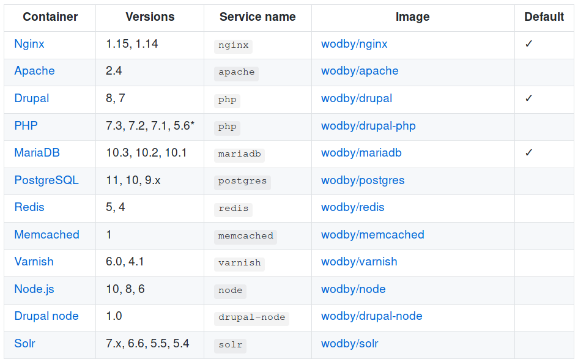
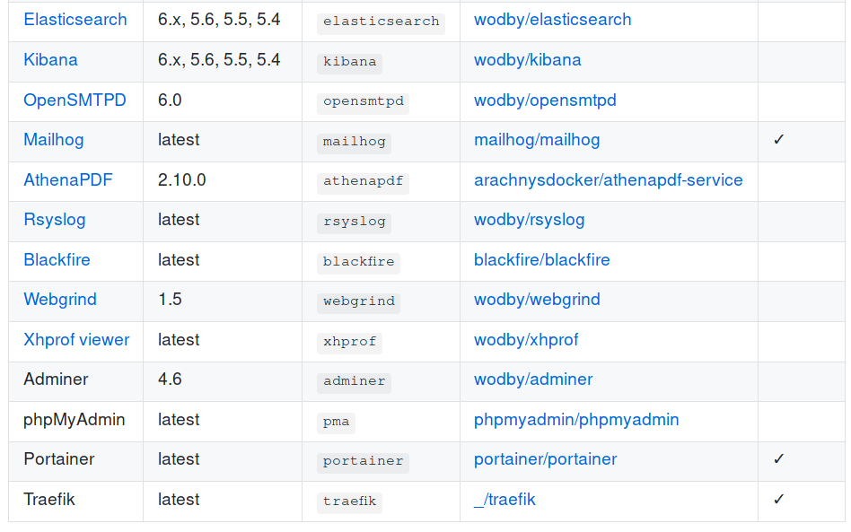

### Local development with Docker4Drupal and BLT

Victor Stanchev

viktor.stanchev@ffwagency.com

github.com/vstanchev

---

### Why virtualize/containerize?

> *"I already have apache, php and mysql on my machine."*

Main benefits:
- same environment across all devs
- easy setup
- easy to try out new software
- easy to test version changes

---

### What is Docker?
>*Docker is a computer program that performs operating-system-level virtualization, also known as "containerization".*

---

### What is Docker?
 - run software packages called "containers"
 - containers are isolated from each other 
 - bundle their own application, tools, libraries and configuration files
 - can communicate with each other
 
---
 
### What is Docker?
 - all containers are run by a single operating-system kernel
 - more lightweight than virtual machines
 - created from "images" that specify their precise contents
 - images are often created by combining and modifying standard images downloaded from public repositories
 
---

### What docker-compose does?

>*Compose is a tool for defining and running multi-container Docker applications*

Instead of long docker commands:

```bash
[user@host]$ docker run -d -t -i \
    -e POSTGRES_PASSWORD='foo' \
    -e POSTGRES_USER='bar' \
    -e DB_NAME='mysite_staging' \
    -p 8000:80 \
    -v /var/host/data:/var/container/data
    --link redis:redis \  
    --name mydatabase custom/postgres:tag
```

---

### What docker-compose does?

`docker-compose.yml`:
```yaml
version: "3"
services:
  mydatabase:
    image: custom/postgres:tag
    environment:
      POSTGRES_PASSWORD: foo
      POSTGRES_USER: bar
      DB_NAME: mysite_staging
    volumes:
      - /var/host/data:/var/container/data
    ports:
      - '8000:80'
  redis:
    image: ...
    ...
```

---

### What is Docker4Drupal?


In essence - a collection of pre-built docker images and a `docker-compose.yml`


A bunch of shortcut commands defined in a `Makefile`.

---

### Images



---

### Images



---

## Demo

---

### How to customize?

Just add additional services in the `docker-compose.yml` or additional commands
in the `Makefile`.

---

### Docker4Drupal benefits

 - [+] relatively simple and standard
 - [+] plenty of customization
 - [+] smaller images based on Alpine Linux (2x smaller than Docksal)
 - [+] environment is pre-built
 - [+] stable enough for production (Wodby)
 - [-] additional setup needed to run multiple projects
 - [-] Docker on OS X suffers in performance
 
---

### How it’s different from DrupalVM?

 - [+] stable support on more OSes
 - [-+] full virtualization with VirtualBox and Vagrant
 - [-] guest resources are limited
 - [-] large initial download
 - [-] environment is built locally
 - [-] file sharing is a bit awkward

---

### How it's different from Docksal?

 - [+] uses Docker containers and docker-compose files
 - [+] plenty of options for customization
 - [+] can run multiple projects at once
 - [-] modifies some system configurations (e.g. DNS)
 - [-] it's a ~8000 line bash script
 - [-] relatively large images
 - [-] Docker on OS X suffers in performance
 
---

## Questions?


